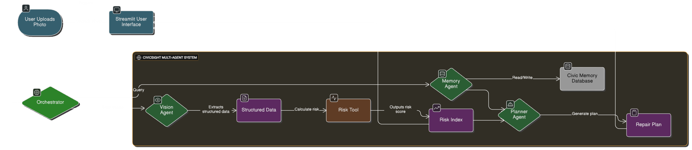

# 👁️ CivicSight: AI-Powered Infrastructure Auditor
### 🌍 Track: Agents for Good (Smart Cities & Governance)

[](PASTE_YOUR_HUGGINGFACE_LINK_HERE)
[](https://deepmind.google/technologies/gemini/)

## 🎥 Project Demo
### [▶️ Click Here to Watch the Video Walkthrough](PASTE_YOUR_YOUTUBE_LINK_HERE)

---

## 1. The Problem: Cities are "Blind"
Urban infrastructure maintenance is currently **reactive** and **unstructured**.
* **No Standard:** A citizen reports a "bad pothole," but city officials have no objective way to measure severity remotely.
* **No Memory:** If a road is repaired and breaks again in two weeks, legacy systems treat it as a "new" issue, failing to detect the **trend** of poor workmanship.
* **Slow Response:** Manual inspection takes days.

## 2. The Solution: CivicSight
CivicSight is a Multi-Agent system that transforms a single photo into a **Quantified Risk Assessment**. It moves governance from "Reactive Repairs" to "Proactive Auditing."

### 🚀 Key Capabilities
1.  **Quantifies Risk:** Uses Computer Vision to assign a specific `Risk Index` (0-100) based on severity and environmental context.
2.  **Long-Term Memory:** Remembers every audit. If you upload a photo of a location that has been reported before, it flags it as a **"Recurring Issue"**.
3.  **Action Planning:** Instantly generates a technical repair plan and budget estimate.

---

## 3. Agent Architecture

I implemented a **Sequential Multi-Agent Pipeline** powered by **Google Gemini 2.0 Flash**:

* **👁️ Agent-V (Vision):** The Perception Layer. It analyzes images to extract structured metadata (Damage Type, Severity 1-10).
* **🧮 Tool (Risk Engine):** A deterministic Python function that calculates safety scores based on strict variables. *Example: If `heavy_traffic=True`, Risk Score += 15.*
* **🧠 Agent-M (Memory):** The Context Layer. It queries a persistent JSON database to retrieve history.
* **👷 Agent-P (Planner):** The Reasoning Layer. It uses **Context Compaction** to summarize history and generate a remediation plan.

---

## 4. Technical Implementation (Scoring Criteria)
This project demonstrates **5 Key Agent Concepts**:
1.  **Sequential Agents:** (Vision → Tool → Planner).
2.  **Custom Tools:** (`risk_assessment_tool` for deterministic logic).
3.  **Long-Term Memory:** Persistent database (JSON) vs. ephemeral chat history.
4.  **Context Engineering:** Summarizing historical logs to save tokens.
5.  **Observability:** Real-time "Trace Logs" in the UI to visualize agent thought processes.

## 5. How to Run Locally

1. Clone the repository:
   ```bash

   git clone [https://github.com/shreyas07-anonymous/CivicSight-Capstone.git](https://github.com/shreyas07-anonymous/CivicSight-Capstone.git)

